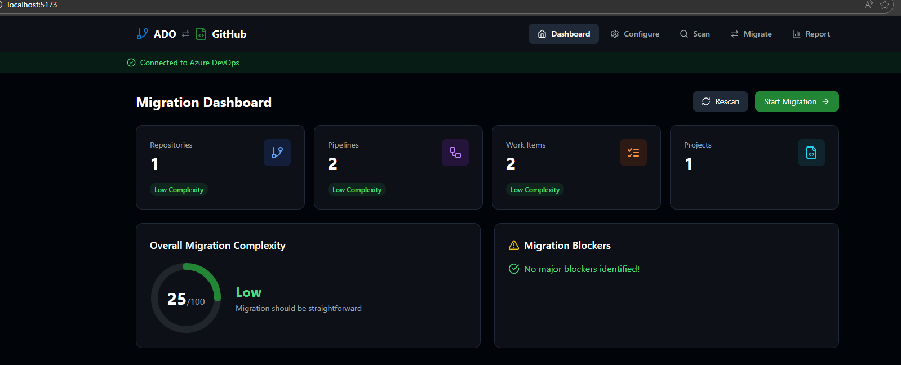
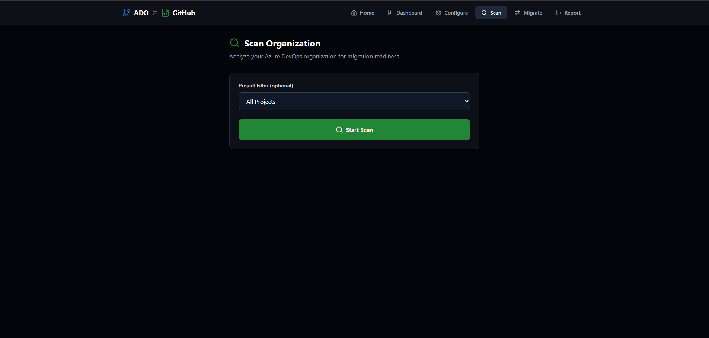
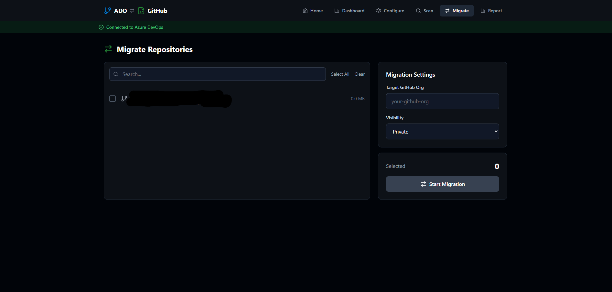
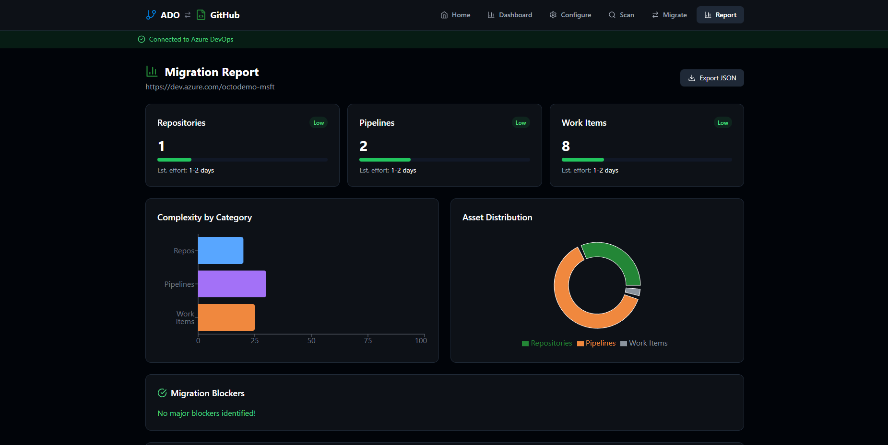

# ADO Migration Readiness Analyzer 🔍

A CLI tool + Web UI that analyzes Azure DevOps organizations and generates comprehensive migration readiness reports for GitHub migrations, with the ability to **migrate repositories directly to GitHub**.

[](https://www.python.org/downloads/)
[](https://opensource.org/licenses/MIT)
[](https://github.com/features/copilot)

## 📸 Screenshots

### Dashboard


### Scan Progress


### Migration


### Report


## 🎯 Problem

Before migrating from Azure DevOps to GitHub, enterprises need to understand:
- What assets exist in their ADO organization
- Which items can migrate easily vs. require manual work
- How complex the migration will be
- What order to migrate things in

**GitHub Enterprise Importer (GEI) handles the migration, but no tool helps with planning and assessment.** This tool fills that gap!

## ✨ Features

### 🖥️ Web UI
- **🎨 Beautiful Dark Theme Dashboard** - Visual summary with complexity meter and charts
- **⚙️ Easy Configuration** - Set up ADO and GitHub credentials in one place
- **📊 Real-time Scanning** - Progress bar with live updates
- **🚀 One-Click Migration** - Select repos and migrate them directly to GitHub
- **📈 Interactive Reports** - Charts and expandable project details

### 💻 CLI
- **📊 Organization Scan** - Discover all projects, repos, pipelines, and work items
- **🔍 Compatibility Analysis** - Identify what maps to GitHub and what doesn't
- **📈 Complexity Scoring** - Get Low/Medium/High ratings per asset type
- **📄 Rich Reports** - Console output, HTML, and JSON export

## 🚀 Quick Start

### Prerequisites

- Python 3.10+
- Node.js 18+ (for Web UI)
- [GitHub CLI](https://cli.github.com/) with [ado2gh extension](https://github.com/github/gh-ado2gh) (for migration)

```bash
# Install gh CLI extension for migration
gh extension install github/gh-ado2gh
```

### Option 1: Web UI (Recommended)

**Step 1: Clone and set up the project**
```bash
git clone https://github.com/nkusakula/ADO-to-GitHub-Pre-migration-assessment-tool.git
cd ADO-to-GitHub-Pre-migration-assessment-tool

# Create virtual environment
python -m venv venv
venv\Scripts\activate  # Windows
# source venv/bin/activate  # Linux/Mac
```

**Step 2: Start the Backend (Terminal 1)**
```bash
cd backend
pip install fastapi uvicorn pyyaml httpx
pip install -e ../
uvicorn main:app --reload --port 8000
```

**Step 3: Start the Frontend (Terminal 2)**
```bash
cd frontend
npm install
npm run dev
```

**Step 4: Open the App**

Navigate to **http://localhost:5173** in your browser!

### Option 2: CLI Only

```bash
pip install -e .
ado-readiness configure
ado-readiness scan
ado-readiness report --format html -o report.html
```

## 🌐 Using the Web UI

### 1️⃣ Configure Credentials

1. Click **Configure** in the sidebar
2. Enter your **Azure DevOps** details:
   - Organization URL (e.g., `https://dev.azure.com/myorg`)
   - Personal Access Token (PAT) with read permissions
3. Enter your **GitHub** details (for migration):
   - Personal Access Token with `repo`, `workflow`, and `admin:org` scopes
4. Click **Save Configuration**

### 2️⃣ Scan Your Organization

1. Click **Scan** in the sidebar
2. Click **Start Scan**
3. Watch the real-time progress bar
4. When complete, you'll be redirected to the Dashboard

### 3️⃣ View the Dashboard

The dashboard shows:
- **Summary Cards** - Total projects, repos, pipelines, work items
- **Complexity Meter** - Overall migration complexity score
- **Blockers** - Issues that need attention before migration

### 4️⃣ Migrate Repositories

1. Click **Migrate** in the sidebar
2. Select the repositories you want to migrate (checkboxes)
3. Enter the **Target GitHub Organization** name
4. Choose **Visibility** (private/public/internal)
5. Click **Start Migration**
6. Watch the progress for each repository

> **Note:** Migration requires you to be an owner or have migrator role in the target GitHub organization.

### 5️⃣ View Detailed Report

Click **Report** in the sidebar to see:
- Interactive charts (repos by project, work items by type)
- Expandable project details
- Pipeline and work item breakdowns

## 💻 CLI Usage

### Configure your connection

```bash
ado-readiness configure
```

You'll be prompted for:
- Azure DevOps organization URL (e.g., `https://dev.azure.com/myorg`)
- Personal Access Token (PAT) with read permissions

### Test connection

```bash
ado-readiness test-connection
```

### Scan your organization

```bash
# Scan entire organization
ado-readiness scan

# Scan a specific project
ado-readiness scan --project MyProject

# Verbose output
ado-readiness scan --verbose
```

### Generate reports

```bash
# Console summary (default)
ado-readiness report

# Export to HTML
ado-readiness report --format html --output report.html

# Export to JSON
ado-readiness report --format json --output report.json
```

## 📊 Example Output

```
╭──────────────────────────────────────────────────────────╮
│           ADO Migration Readiness Report                 │
│           Organization: contoso-dev                      │
╰──────────────────────────────────────────────────────────╯

📊 Summary
┌─────────────┬───────┬────────────┬─────────────┐
│ Asset Type  │ Count │ Complexity │ Est. Effort │
├─────────────┼───────┼────────────┼─────────────┤
│ Repositories│    45 │ Low        │ 2 days      │
│ Pipelines   │   120 │ High       │ 2 weeks     │
│ Work Items  │ 3,400 │ Medium     │ 1 week      │
│ Boards      │    12 │ Low        │ 2 days      │
└─────────────┴───────┴────────────┴─────────────┘

Overall Migration Complexity: MEDIUM (65/100)

⚠️  Blockers Found: 3
  • 15 Classic pipelines require manual conversion
  • 5 custom work item types need mapping
  • 2 repos use TFVC (requires special handling)
```

## 🛠️ Project Structure

```
ADO-to-GitHub-Pre-migration-assessment-tool/
├── src/ado_readiness/     # CLI source code
│   ├── cli.py             # Typer CLI commands
│   ├── ado_client.py      # Azure DevOps API client
│   ├── scanner.py         # Organization scanner
│   └── reporter.py        # Report generator
├── backend/               # FastAPI backend
│   └── main.py            # API endpoints
├── frontend/              # React + Vite frontend
│   └── src/
│       ├── App.tsx        # Main app with routing
│       └── components/    # Dashboard, Scan, Migrate, etc.
├── docs/                  # Documentation
└── tests/                 # Test files
```

## 🛠️ Development

```bash
# Clone the repo
git clone https://github.com/nkusakula/ADO-to-GitHub-Pre-migration-assessment-tool.git
cd ADO-to-GitHub-Pre-migration-assessment-tool

# Create virtual environment
python -m venv venv
venv\Scripts\activate  # Windows
# source venv/bin/activate  # Linux/Mac

# Install dev dependencies
pip install -e ".[dev]"

# Run tests
pytest

# Run linter
ruff check src/
```

## 🔧 Troubleshooting

### "Failed to lookup Organization ID" during migration
- Ensure you're migrating to a **GitHub Organization**, not a personal account
- Verify you have owner or migrator role in the target org
- Check your GitHub PAT has the required scopes

### Scan not completing
- Check the backend console for errors
- Verify your ADO PAT has read permissions for all projects
- Try scanning a single project first with `--project`

### Backend won't start
- Make sure port 8000 is not in use
- Install dependencies: `pip install fastapi uvicorn pyyaml httpx`

## 📝 License

MIT License - see [LICENSE](LICENSE) for details.

## 🤝 Contributing

Contributions welcome! Please read our contributing guidelines first.

## 🙏 Acknowledgments

- Built with [GitHub Copilot CLI](https://github.com/features/copilot)
- Uses [GitHub Enterprise Importer](https://docs.github.com/en/migrations) for migrations
- UI powered by [React](https://react.dev/), [Vite](https://vitejs.dev/), and [TailwindCSS](https://tailwindcss.com/)


